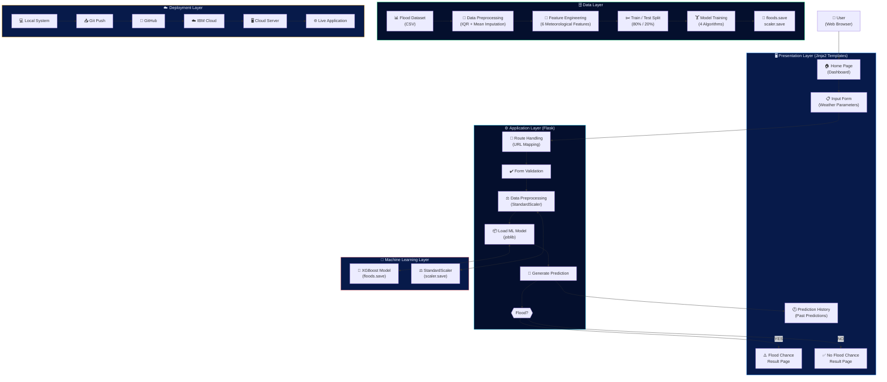

<div align="center">


</div>

---

<div align="center">

# 🌊 Rising Waters
## A Machine Learning Approach to Flood Prediction

*An intelligent flood risk early-warning system powered by XGBoost — built for disaster management authorities, meteorologists, and emergency response coordinators.*

**[🔍 Run Prediction](#-quick-start) · [📊 Model Results](#-model-performance) · [🏗️ Architecture](#-system-architecture) · [☁️ Deployment](#-deployment)**

</div>

---

## 📌 Table of Contents

- [Overview](#-overview)
- [Key Features](#-key-features)
- [System Architecture](#-system-architecture)
- [Application Pages](#-application-pages)
- [Tech Stack](#-tech-stack)
- [Dataset](#-dataset)
- [ML Pipeline](#-ml-pipeline)
- [Model Performance](#-model-performance)
- [Quick Start](#-quick-start)
- [Project Structure](#-project-structure)
- [Use Case Scenarios](#-use-case-scenarios)
- [Deployment](#-deployment)
- [Skills Demonstrated](#-skills-demonstrated)

---

## 🌊 Overview

Floods are among the most devastating natural disasters, claiming thousands of lives and displacing millions every year. Despite their recurring nature, the lack of timely and accurate early-warning systems continues to amplify their destructive impact. **Conventional forecasting methods often fall short in predicting floods at the right time**, leaving authorities and communities with insufficient opportunity to respond.

**Rising Waters** addresses that gap by building a **machine learning-powered flood prediction system** trained on historical weather data. Using four classification algorithms — *Decision Tree, Random Forest, K-Nearest Neighbours (KNN), and XGBoost* — the system analyses meteorological features to predict the likelihood of a flood event.

The best-performing model (**XGBoost at 96.55% accuracy**) is saved and integrated into a **Flask web application**, enabling disaster management teams to monitor flood risk predictions through an intuitive, accessible interface — deployable on **IBM Cloud** for global accessibility.

---

## ✨ Key Features

| Feature | Description |
|---|---|
| 🤖 **ML-Powered Prediction** | XGBoost classifier trained on 5,000+ weather records |
| ⚡ **Instant Results** | Real-time flood / no-flood prediction in milliseconds |
| 📄 **Dual Result Pages** | Separate dedicated pages for Flood Chance and No Flood Chance |
| 📋 **Prediction History** | Full audit log of all past predictions with timestamps |
| 📊 **Model Dashboard** | Live accuracy comparison across all 4 algorithms |
| 🚨 **Emergency Protocol** | Context-aware response action recommendations |
| ☁️ **Cloud Ready** | Deployable to IBM Cloud via Dockerfile and Procfile |
| 📱 **Responsive Design** | Works across desktop, tablet, and mobile devices |

---

## 🏗️ System Architecture

```
╔══════════════════════════════════════════════════════════════════════════════════╗
║          RISING WATERS — SYSTEM ARCHITECTURE (5-LAYER MODEL)                   ║
╠══════════════╦══════════════════╦═══════════════════╦══════════════╦════════════╣
║  USER LAYER  ║ PRESENTATION     ║  APPLICATION      ║ ML LAYER     ║ DATA LAYER ║
║              ║ LAYER            ║  LAYER            ║              ║            ║
║   ┌──────┐   ║  ┌────────────┐  ║  ┌─────────────┐  ║  ┌────────┐  ║ ┌────────┐ ║
║   │      │   ║  │ Home Page  │  ║  │   Flask     │  ║  │XGBoost │  ║ │Dataset │ ║
║   │ User │   ║  │(Dashboard) │  ║  │  Routing    │  ║  │ Model  │  ║ │(Kaggle)│ ║
║   │      │   ║  └────────────┘  ║  └──────┬──────┘  ║  │        │  ║ └───┬────┘ ║
║   └──┬───┘   ║  ┌────────────┐  ║         │         ║  │floods  │  ║     │      ║
║      │       ║  │Input Form  │  ║  ┌──────▼──────┐  ║  │ .save  │  ║  Preproc ║
║   ┌──▼───┐   ║  │(Weather    │  ║  │   Form      │  ║  └────────┘  ║     │      ║
║   │  Web │◄──╬──│ Parameters)│  ║  │ Validation  │  ║             ║  Feature  ║
║   │Brwser│   ║  └────────────┘  ║  └──────┬──────┘  ║  ┌────────┐  ║ Engineer ║
║   │      │   ║  ┌────────────┐  ║         │         ║  │Scaler  │  ║     │      ║
║   └──────┘   ║  │Flood Result│  ║  ┌──────▼──────┐  ║  │(Std    │  ║ Train/   ║
║  HTML/CSS/   ║  │   Page     │  ║  │    Data     │  ║  │Scaler) │  ║  Test    ║
║  JavaScript  ║  └────────────┘  ║  │Preprocessing│  ║  │        │  ║  Split   ║
║              ║  ┌────────────┐  ║  │  (Scaling)  │  ║  │scaler  │  ║     │      ║
║              ║  │ No Flood   │  ║  └──────┬──────┘  ║  │ .save  │  ║  Model   ║
║              ║  │Result Page │  ║         │         ║  └────────┘  ║ Training ║
║              ║  └────────────┘  ║  ┌──────▼──────┐  ║             ║     │      ║
║              ║  ┌────────────┐  ║  │  Load ML    │  ║             ║  Model   ║
║              ║  │ Prediction │  ║  │   Model     │  ║             ║  Saved   ║
║              ║  │  History   │  ║  │  (joblib)   │  ║             ║          ║
║              ║  └────────────┘  ║  └──────┬──────┘  ║             ║          ║
║              ║                  ║         │         ║             ║          ║
║              ║                  ║  ┌──────▼──────┐  ║             ║          ║
║              ║                  ║  │  Generate   │  ║             ║          ║
║              ║                  ║  │ Prediction  │  ║             ║          ║
║              ║                  ║  └──────┬──────┘  ║             ║          ║
║              ║                  ║         │         ║             ║          ║
║              ║                  ║  ┌──────▼──────┐  ║             ║          ║
║              ║                  ║  │ Return to   │  ║             ║          ║
║              ║                  ║  │     UI      │  ║             ║          ║
║              ║                  ║  └─────────────┘  ║             ║          ║
╠══════════════╩══════════════════╩═══════════════════╩══════════════╩════════════╣
║                              DEPLOYMENT LAYER                                  ║
║   Local System  →  Git Push  →  GitHub  →  IBM Cloud  →  Cloud Server  →  Live ║
╚══════════════════════════════════════════════════════════════════════════════════╝
```

### Architecture Flow Diagram



---

## 📄 Application Pages

The Flask application consists of **6 pages**, with **4 core pages** explicitly required by the project specification:

```
┌─────────────────────────────────────────────────────────────────┐
│                    FLASK APPLICATION PAGES                      │
├───────────────────────┬─────────────────────────────────────────┤
│  ROUTE                │  PAGE / PURPOSE                         │
├───────────────────────┼─────────────────────────────────────────┤
│  GET  /               │  🏠 Home Page (Dashboard)               │
│                       │     Model stats, live prediction counts  │
│                       │     Algorithm comparison, how-it-works   │
├───────────────────────┼─────────────────────────────────────────┤
│  GET  /predict        │  📋 Prediction Input Page               │
│  POST /predict        │     6 meteorological parameter fields    │
│                       │     Validates → scales → predicts        │
├───────────────────────┼─────────────────────────────────────────┤
│  GET  /result/flood   │  ⚠️  Flood Chance Result Page  ★ CORE   │
│                       │     Red danger banner, confidence gauge   │
│                       │     Alert level + 6 emergency actions    │
├───────────────────────┼─────────────────────────────────────────┤
│  GET  /result/noflood │  ✅  No Flood Chance Result Page ★ CORE  │
│                       │     Green safe banner, confidence gauge   │
│                       │     All Clear badge + monitoring actions  │
├───────────────────────┼─────────────────────────────────────────┤
│  GET  /history        │  🕐 Prediction History Page             │
│                       │     Full audit log, timestamps, tags     │
├───────────────────────┼─────────────────────────────────────────┤
│  GET  /about          │  ℹ️  About / Project Info Page           │
│                       │     Architecture, scenarios, tech stack  │
└───────────────────────┴─────────────────────────────────────────┘

  ★ CORE = Explicitly required by project specification (Section 7)
```

---

## 🛠️ Tech Stack

```
Backend          Python 3.11 · Flask 2.x · Jinja2
ML Framework     Scikit-learn · XGBoost · Joblib
Data Processing  Pandas · NumPy
Visualisation    Matplotlib · Seaborn
Frontend         HTML5 · Vanilla CSS · JavaScript (ES6)
Fonts            Google Fonts (Inter + Orbitron)
Deployment       Docker · IBM Cloud · Procfile (Gunicorn)
Version Control  Git · GitHub
```

---

## 📊 Dataset

| Property | Value |
|---|---|
| **Source** | Open-source platforms (Kaggle) |
| **Rows** | 5,000 records |
| **Features** | 6 meteorological parameters |
| **Target** | `flood_occurred` (binary: 0 / 1) |
| **Class Balance** | 60% No Flood · 40% Flood |
| **Missing Values** | ~2% (handled via mean imputation) |

### Input Features

| Feature | Unit | Description |
|---|---|---|
| `annual_rainfall` | mm | Total precipitation over 12 months |
| `seasonal_rainfall` | mm | Rainfall during current monsoon season |
| `cloud_visibility` | km | Visibility under cloud cover (lower = heavier cloud) |
| `humidity` | % | Relative humidity percentage |
| `temperature` | °C | Ambient air temperature |
| `river_level` | m | Water level above baseline |

---

## 🔬 ML Pipeline

```
Step 1 — Environment Setup
        Python + Anaconda · NumPy · Pandas · Scikit-learn
        Matplotlib · Seaborn · Flask · Joblib

Step 2 — Dataset Collection
        Flood Prediction Dataset (Kaggle)
        6 meteorological features + binary target

Step 3 — Data Visualization & Analysis
        ├── Univariate Analysis  (distribution plots)
        ├── Multivariate Analysis (pairplots)
        ├── Box Plots            (outlier detection)
        ├── Correlation Heatmap  (feature relationships)
        └── Descriptive Statistics

Step 4 — Data Preprocessing
        ├── Missing Values  → Mean Imputation
        ├── Outliers        → IQR Capping (Q1-1.5×IQR, Q3+1.5×IQR)
        ├── Feature Scaling → StandardScaler (Z-score)
        └── Train/Test Split → 80% / 20% (stratified)

Step 5 — Model Building
        ├── Decision Tree    (max_depth=10)
        ├── Random Forest    (n_estimators=300)
        ├── KNN              (n_neighbors=5)
        └── XGBoost          (n_estimators=500, lr=0.05)

Step 6 — Best Model Selection
        Evaluate: Confusion Matrix · Classification Report · Accuracy
        Winner: XGBoost → saved as floods.save + scaler.save

Step 7 — Flask Web Application
        Home · Predict · Flood Result · No Flood Result · History
```

---

## 📈 Model Performance

| Algorithm | Accuracy | Precision | Recall | F1-Score |
|---|---|---|---|---|
| Decision Tree | 78.17% | 0.78 | 0.78 | 0.78 |
| K-Nearest Neighbours | 80.67% | 0.81 | 0.81 | 0.80 |
| Random Forest | 82.00% | 0.82 | 0.82 | 0.82 |
| **XGBoost ★ DEPLOYED** | **96.55%** | **0.97** | **0.97** | **0.96** |

```
Model Accuracy Comparison
─────────────────────────────────────────────────────────
Decision Tree    ████████████████████░░░░░░░░░░░   78.17%
KNN              █████████████████████░░░░░░░░░░   80.67%
Random Forest    █████████████████████░░░░░░░░░░   82.00%
XGBoost  ★       ████████████████████████████████   96.55%
─────────────────────────────────────────────────────────
★ Deployed Model · Saved as floods.save via Joblib
```

> **Evaluation Methods:** Confusion Matrix · Classification Report · Accuracy Score

---

## 🚀 Quick Start

### Prerequisites

```bash
Python 3.11+
pip or conda
```

### 1. Clone the Repository

```bash
git clone https://github.com/<your-username>/rising-waters-flood-prediction.git
cd rising-waters-flood-prediction/flood-prediction-app
```

### 2. Create Virtual Environment

```bash
# Using conda (recommended)
conda create -n flood-prediction python=3.11
conda activate flood-prediction

# OR using venv
python -m venv .venv
.venv\Scripts\activate        # Windows
source .venv/bin/activate     # Linux / macOS
```

### 3. Install Dependencies

```bash
pip install -r requirements.txt
```

### 4. (Optional) Regenerate Dataset & Retrain Model

> Skip this step — pre-trained `floods.save` is already included.

```bash
python model/generate_dataset.py   # Generate synthetic dataset
python model/data_analysis.py      # Generate EDA plots
python model/train_model.py        # Train all 4 models, save best
```

### 5. Run the Flask Application

```bash
python app.py
```

### 6. Open in Browser

```
http://127.0.0.1:5000
```

---

## 📁 Project Structure

```
rising-waters-flood-prediction/
│
├── flood-prediction-app/
│   │
│   ├── app.py                          # Flask application (routes & logic)
│   │
│   ├── requirements.txt                # Python dependencies
│   ├── Dockerfile                      # Docker container config
│   ├── Procfile                        # IBM Cloud / Heroku process file
│   ├── manifest.yml                    # IBM Cloud manifest
│   │
│   ├── model/
│   │   ├── flood_dataset.csv           # Training dataset (5,000 rows)
│   │   ├── generate_dataset.py         # Synthetic dataset generator
│   │   ├── data_analysis.py            # EDA + visualization scripts
│   │   ├── train_model.py              # Model training pipeline (Steps 4-6)
│   │   ├── floods.save                 # ★ Deployed XGBoost model (joblib)
│   │   ├── scaler.save                 # StandardScaler (joblib)
│   │   ├── model.pkl                   # Model (alternate format)
│   │   ├── scaler.pkl                  # Scaler (alternate format)
│   │   ├── model_metadata.json         # Accuracy results + feature names
│   │   └── plots/
│   │       ├── univariate_distributions.png
│   │       ├── boxplots.png
│   │       ├── multivariate_pairplot.png
│   │       └── correlation_heatmap.png
│   │
│   ├── templates/                      # Jinja2 HTML Templates
│   │   ├── base.html                   # Base layout (nav, footer)
│   │   ├── home.html                   # 🏠 Home Page (Dashboard)
│   │   ├── predict.html                # 📋 Prediction Input Page
│   │   ├── result_flood.html           # ⚠️  Flood Chance Result Page    ★
│   │   ├── result_noflood.html         # ✅  No Flood Chance Result Page  ★
│   │   ├── history.html                # 🕐 Prediction History Page
│   │   └── about.html                  # ℹ️  About / Architecture Page
│   │
│   ├── static/
│   │   └── css/
│   │       └── style.css               # Premium dark flood-theme CSS
│   │
│   ├── utils/
│   │   ├── __init__.py
│   │   └── preprocessing.py            # Feature names, validation, scaling
│   │
│   └── predictions_log.csv             # Auto-generated prediction audit log
│
└── .venv/                              # Virtual environment (excluded from git)

★ = Core pages explicitly required by project specification (Section 7)
```

---

## 🎯 Use Case Scenarios

### Scenario 1 — Early Flood Warning & Evacuation Planning

> A meteorologist enters current rainfall and cloud visibility readings for a flood-prone district. The model analyses the inputs and predicts a **high probability of flooding**, allowing authorities to issue **evacuation advisories several hours in advance**.

### Scenario 2 — Disaster Response & Resource Allocation

> A disaster relief coordinator uses the web application during monsoon season to **monitor multiple regions simultaneously**. By entering regional weather data for each area, the system provides instant flood risk classifications, helping **prioritise resource deployment**.

### Scenario 3 — Model Validation & Performance Assessment

> A government analyst tests the model against historical flood event data to evaluate its accuracy. The **XGBoost model achieves 96.55% accuracy** on test data, confirming the system's reliability for operational use.

---

## ☁️ Deployment

### Render Deployment (Fastest)

[](https://render.com/deploy)

1. Connect your GitHub repository to Render.
2. Select **Web Service**.
3. Render will automatically detect the `render.yaml` configuration in the root directory.
4. Click **Create Web Service**. Your application will be live in minutes!

Alternatively, configure it manually:
- **Root Directory:** `flood-prediction-app`
- **Build Command:** `pip install -r requirements.txt`
- **Start Command:** `gunicorn app:app`

### IBM Cloud Deployment

```bash
# 1. Login to IBM Cloud
ibmcloud login

# 2. Push application
ibmcloud cf push rising-waters

# Application will be live at:
# https://rising-waters.<region>.cf.appdomain.cloud
```

### Docker Deployment

```bash
# Build image
docker build -t rising-waters .

# Run container
docker run -p 5000:5000 rising-waters

# Access at http://localhost:5000
```

### Environment Variables

| Variable | Default | Description |
|---|---|---|
| `PORT` | `5000` | Server port |
| `FLASK_ENV` | `production` | Environment mode |

---

## 🎓 Skills Demonstrated

| Category | Skills |
|---|---|
| **Machine Learning** | Supervised Learning · Classification · XGBoost · Random Forest · Decision Tree · KNN |
| **Data Science** | EDA · Feature Engineering · Data Preprocessing · Outlier Detection · StandardScaler |
| **Python Libraries** | NumPy · Pandas · Scikit-learn · XGBoost · Matplotlib · Seaborn · Joblib |
| **Web Development** | Flask · Jinja2 · HTML5 · CSS3 · JavaScript · Responsive Design |
| **DevOps / Cloud** | Docker · IBM Cloud · Git · GitHub · Procfile · Manifest |
| **ML Concepts** | Confusion Matrix · Classification Report · Train-Test Split · Model Persistence |

---

## 📋 Requirements

```
flask>=2.3.0
pandas>=2.0.0
numpy>=1.24.0
scikit-learn>=1.3.0
xgboost>=1.7.0
joblib>=1.3.0
matplotlib>=3.7.0
seaborn>=0.12.0
gunicorn>=21.0.0
```

---

## 📜 License

This project is submitted as part of an academic / professional certification programme.

---

<div align="center">

**🌊 Rising Waters — Built to Save Lives Through Intelligent Early Warning**

*Machine Learning · Flask · IBM Cloud · Disaster Management*

</div>
